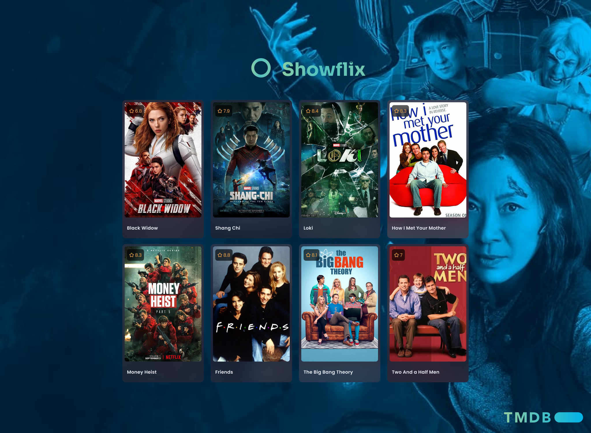

# Sprint 9. React entrega final

### ****[Live Site]( https://react-sprint9.netlify.app/)****

### **🎯 Objetivos generales**

- Poner en práctica los conceptos del curso.

### **🎯 Objetivos específicos**

- [x] 📬  Crear por lo menos 5 componentes.
- [ ] 📪  Usar input y output para pasar datos entre componentes.
- [x] 📬  Usar las rutas.
- [ ] 📪  Utilizar Redux o Context.
- [x] 📬  Llamar mínimo a una API externa.
- [x] 📬  Emplear servicios para implementar lógica de negocio y/o llamadas API.
- [ ] 📪  Implementar login/registro, idealmente con Firebase, aunque puedes hacerlo con localStorage.
- [ ] 📪  Proteger las rutas, bien porque haya un usuario administrador/a que puede sólo ver una parte, o porque haya usuarios normales y premium.
- [ ] 📪  Responsive.

📌 La solución debe estar operativa libre de bugs, pudiendo el mentor/a realizar un flujo de usuario completo (una acción concreta, si por ejemplo es un e-commerce, sería hacer el proceso de compra entero, desde que entra en la web hasta que va al pago).

